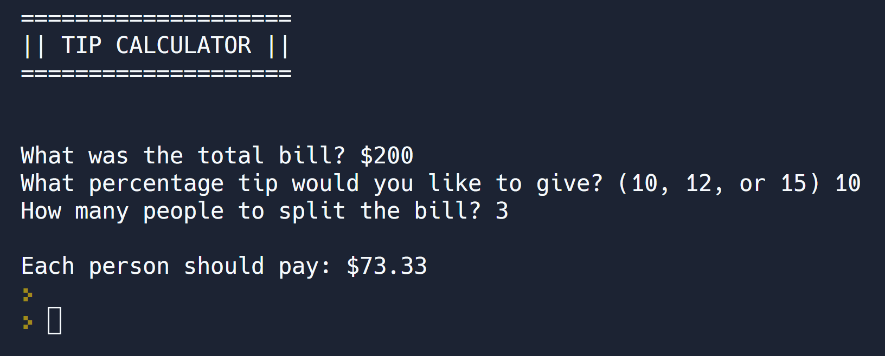

# Day 002 project - Tip Calculator

This project consist of a tip calculator via terminal: takes the total bill, the percentage of tip you like to pay, and the number of people that are gonna pay for the bill. Returns the amount of money each person have to pay. Try it [here](https://replit.com/@DarienPerez29/tip-calculator?embed=1&output=1)

## Try it

You can try the project via Replit [here](https://replit.com/@DarienPerez29/tip-calculator?embed=1&output=1), you just need a web browser.