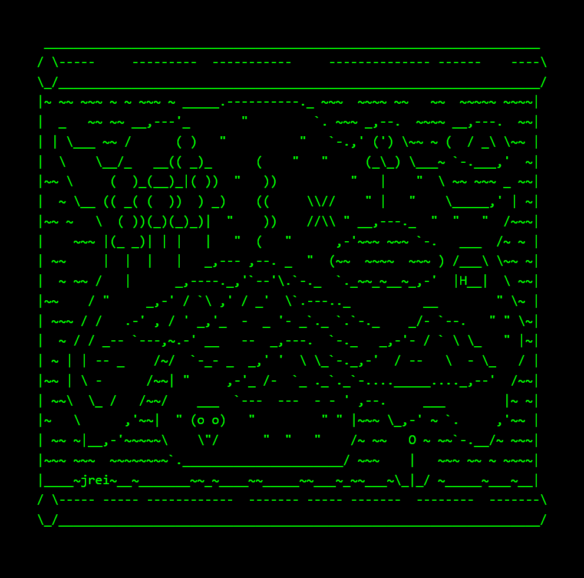

# Day 003 project - Treasure Island Game

This is a little terminal game in which you have to make decisions to get the treasure. If you take the wrong decisions, you might die (game over). Just luck and replay are required to win, no logic whatsoever is needed. Try it [here](https://replit.com/@DarienPerez29/treasure-map-game?embed=1&output=1).

## Challenges

Today I've decided to include some challenges of the course. Today's challenges are:

| # | Name | Description of challenge |
| --- | --- | --- |
| 1 | [Odd or Even](../challenges/challenge1.py) | This program takes a number and determines if is odd or even. |
| 2 | [BMI Calculator 2.0](../challenges/challenge2.py) | This program determines the BMI based on the user's weight and height and then interprets it. |
| 3 | [Leap Year](../challenges/challenge3.py) | This program takes a year and determines if is a leap year or a normal year. |
| 4 | [Pizza Order Practice](../challenges/challenge4.py) | This program simulates a pizza order program. |
| 5 | [Love Calculator](../challenges/challenge5.py) | This program test the "compatibility between two people" by the letters of their names. |

*You can ignore **practice** directory, just contains a few random programs to practice some concepts.*

## Try it

You can try the project via Replit [here](https://replit.com/@DarienPerez29/treasure-map-game?embed=1&output=1), you just need a web browser.