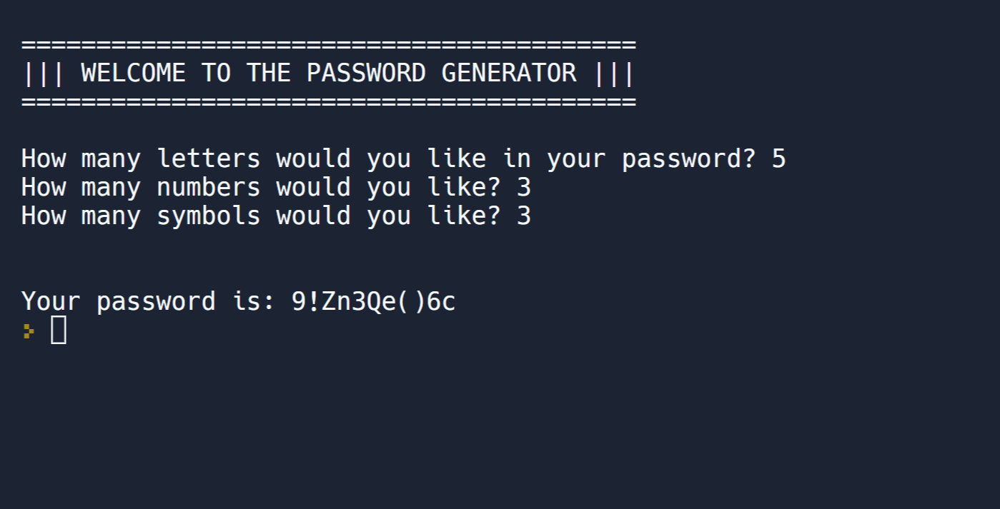

# Day 005 project - Password Generator

This is a basic password generator that asks for the number of letters `[a-zA-Z]`, numbers `[0-9]`, and symbols `[!#$%&()*+]`, and returns a password with those characteristics.

**Try it on Replit [here](https://replit.com/@DarienPerez29/password-generator?embed=1&output=1).**

## Challenges

Today's challenges are:

| # | Name | Description of challenge |
| --- | --- | --- |
| 1 | [Average Height](../challenges/challenge1.py) | This program calculates the average of a list of students' heights. |
| 2 | [High Score](../challenges/challenge2.py) | This program determines the highest score from a list of scores. |
| 3 | [Adding Even Numbers](../challenges/challenge3.py) | This program calculates the sum of all the even numbers from 1 to 100. |
| 4 | [FizzBuzz](../challenges/challenge4.py) | This program prints the solution to the FizzBuzz game.   **Rules:**   <ul><li>Print each number from 1 to 100 in turn.</li><li>If the number is divisible by 3, then print "Fizz" instead of the number.</li><li>If the number is divisible by 5, then print "Buzz" instead of the number.</li><li>If the number is divisible by 3 and 5, then print "FizzBuzz" instead of the number.</li></ul> |

*You can ignore **practice** directory, just contains a few random programs to practice come basic concepts.*