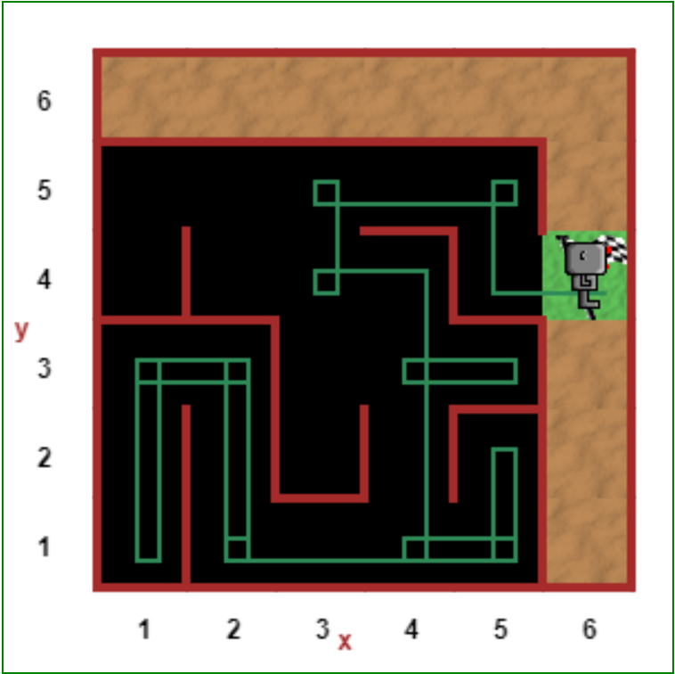

# Day 006 project - Escaping the Maze

This program consist of a very simple algorithm to help a robot to cross the finish line in a maze. The robot is randomly generated in the maze. The strategy is to keep a wall on the right while going through the maze.

You can try the challenge at [Reeborg's World - Maze wold](https://reeborg.ca/reeborg.html?lang=en&mode=python&menu=worlds%2Fmenus%2Freeborg_intro_en.json&name=Maze&url=worlds%2Ftutorial_en%2Fmaze1.json).

If you want to check my solution, you can copy the code at [escaping-the-maze.py](../escaping-the-maze.py) file, and paste it on Reeborg's World web.

## Challenges

Today's challenges are:

| # | Name | Description of challenge |
| --- | --- | --- |
| 1 | [The Hurdles Loop Challenge](../challenges/challenge1.py) | Make Reeborg run the course following the path shown. |
| 2 | [Hurdles Challenge using While Loops](../challenges/challenge2.py) | Make Reeborg run the course following the path shown by using while loops. |
| 3 | [Hurdles with variables heights](../challenges/challenge3.py) | Make Reeborg run the course avoiding the hurdles with variables heights. |

*You can ignore **practice** directory, just contains a few random programs to practice some basic concepts.*