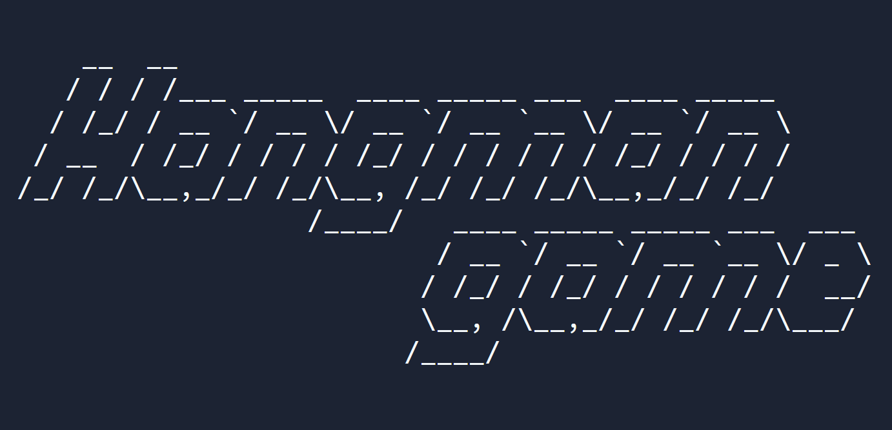

# Day 007 project - Hangman Project

This is a little hangman game via terminal where you play by choosing letter by letter. The word to guess is selected randomly by the computer. You have in total **6** lives to play.

**Try it on Replit [here](https://replit.com/@DarienPerez29/hangman-game?embed=1&output=1).**

## Challenges

| # | Name | Description of challenge |
| --- | --- | --- |
| 1 | [Picking a Random word and checking answers](../challenges/challenge1.py) | Check if the letter selected by the user is one of the leters of a randomly chosen word. |
| 2 | [Replacing blanks with guesses](../challenges/challenge2.py) | Replace blank spaces with the letter chosen by the user. |
| 3 | [Checking if the player has won](../challenges/challenge3.py) | Add while loop allowing to the player guess multiple times. If they guesses all of the letters, the game is over.
| 4 | [Keeping Track of the player's lives](../challenges/challenge4.py) | Set lives and reduce the number of lives if user guess wrong. |